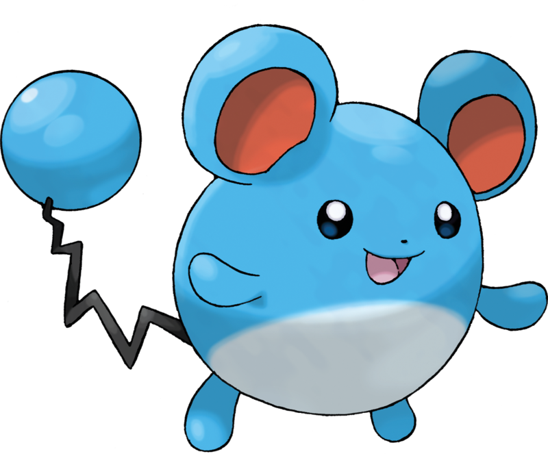
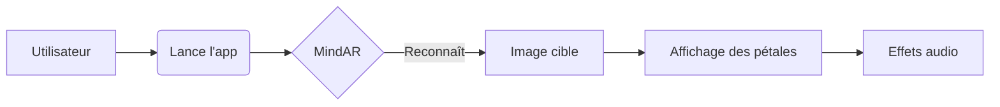

# Chowa 🍃


Chowa est une petite application de réalité augmentée construite avec Svelte, Vite, Tailwind et A-Frame. Elle permet d'afficher des scènes AR légères où des pétales de sakura tombent doucement au fil de la collection d'éléments.



## ✨ Fonctionnalités

- ✨ Animation de particules de sakura
- 🌸 Suivi d'images grâce à MindAR
- 🎧 Lecture de sons et d'extraits vocaux
- 💡 Mode développement avec code Svelte modulaire

## Prérequis

- Node.js 18+
- pnpm ou npm

## Installation

```bash
pnpm install
```

### Développement

```bash
pnpm run dev
```
Ouvre ensuite [http://localhost:5173](http://localhost:5173) dans ton navigateur.

### Build

```bash
pnpm run build
```
Les fichiers générés se trouvent dans `dist/`.

## Diagramme



## Documentation

Plus d'informations dans le dossier [docs](docs/overview.md).

## Licence

Ce projet est sous licence [MIT](LICENSE).

