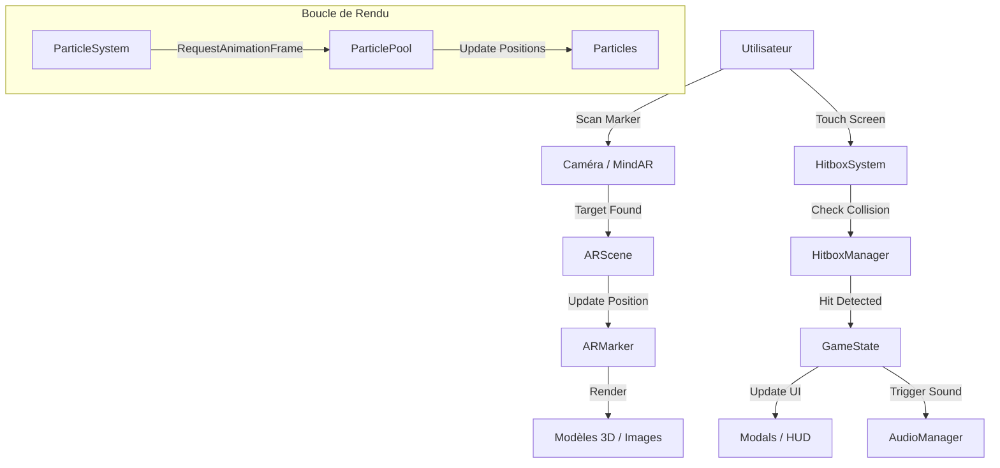

# 🏗️ Architecture Technique

Ce document détaille l'architecture technique de **Chowa**, en expliquant l'organisation du code, les principaux systèmes et les flux de données.

## 📂 Structure du Projet

L'architecture suit une approche modulaire, séparant clairement la logique métier, l'interface utilisateur et les composants AR.

```
src/lib/
├── components/           # Composants Svelte réutilisables
│   ├── ar/              # Composants liés à A-Frame et MindAR
│   ├── hitbox/          # Système de détection d'interactions
│   ├── particles/       # Système de particules (Sakura)
│   └── ui/              # Interface utilisateur (Modals, HUD)
│
├── stores/              # Gestion d'état (Svelte 5 Runes)
│   ├── gameState.svelte.ts
│   ├── audioState.svelte.ts
│   └── particleState.svelte.ts
│
├── managers/            # Logique métier pure (Classes TS)
│   ├── ar/             # Gestionnaires AR (HitboxManager)
│   ├── audio/          # Moteur audio
│   └── particles/      # Moteur de particules
│
├── config/             # Constantes et configuration globale
│   └── constants.ts
│
├── geometry.ts         # Utilitaires mathématiques
└── AR.svelte          # Point d'entrée de l'expérience AR
```

## 🧩 Systèmes Principaux

### 1. Système AR (`components/ar/`)

Le cœur de l'application repose sur l'intégration de A-Frame avec Svelte.

- **`ARScene.svelte`** : Composant racine qui initialise la scène A-Frame (`<a-scene>`) et configure MindAR. Il gère le cycle de vie de la session AR.
- **`ARMarker.svelte`** : Représente une cible d'image (`<a-entity mindar-image-target>`). Il contient les éléments virtuels qui doivent apparaître sur un marker spécifique.
- **`ARAssets.svelte`** : Précharge les assets (images, modèles, sons) dans le `<a-assets>` manager pour optimiser les performances.

### 2. Système de Particules (`components/particles/`)

Pour créer l'ambiance "Sakura", un système de particules performant a été développé.

- **`ParticleSystem.svelte`** : Composant qui gère le rendu des particules dans la scène AR.
- **`ParticlePool.ts`** : Implémente le pattern **Object Pool**. Au lieu de créer et détruire des objets DOM/JS en permanence (ce qui cause du Garbage Collection et des lags), on réutilise un ensemble fixe de particules.
  - _Initialisation_ : Crée X particules au démarrage.
  - _Acquire_ : Récupère une particule inactive.
  - _Release_ : Remet une particule dans le pool quand elle sort de l'écran.

### 3. Système de Hitbox (`components/hitbox/`)

A-Frame gère mal les clics sur des objets complexes en AR mobile. Nous avons implémenté un système de "Hitbox" personnalisé.

- **`HitboxSystem.svelte`** : Superpose un canvas invisible sur la vue caméra.
- **`HitboxManager.ts`** :
  1.  Projette les coordonnées 3D des objets AR vers les coordonnées 2D de l'écran.
  2.  Détecte si un "touch" de l'utilisateur correspond à la zone d'un objet.
  3.  Gère la détection de contours (pixel perfect) pour les images transparentes.

### 4. Gestion d'État (`stores/`)

Utilisation des **Runes** de Svelte 5 pour un état réactif granulaire.

- **`gameState.svelte.ts`** : Suit la progression du joueur (items collectés, déblocages). Persistant via `localStorage`.
- **`audioState.svelte.ts`** : Gère l'état global de l'audio (mute, volume, pistes actives).

## 🔄 Flux de Données



## 📐 Décisions Techniques

> [!IMPORTANT] > **Pourquoi pas Three.js pur ?**
> A-Frame (basé sur Three.js) a été choisi pour sa syntaxe déclarative HTML qui s'intègre naturellement avec le système de templates de Svelte, facilitant la manipulation de la scène via le state.

> [!TIP] > **Optimisation Mobile**
> L'usage intensif de l'Object Pooling (Audio et Particules) et la détection de hitbox sur un thread principal allégé sont cruciaux pour maintenir 60fps sur mobile.
